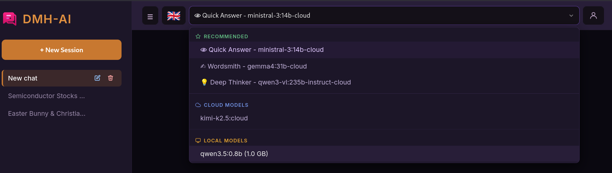
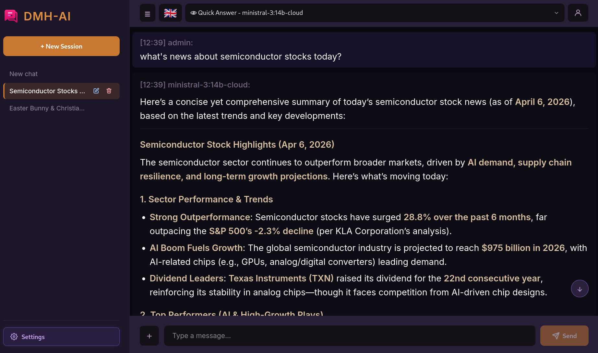
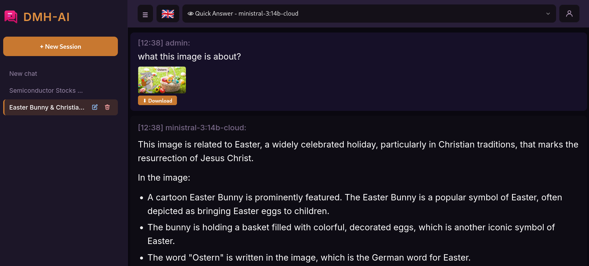

# DMH-AI

Ứng dụng chat AI tự host chạy trên máy tính của bạn — giống ChatGPT, nhưng riêng tư, miễn phí và hoàn toàn thuộc về bạn.

DMH-AI được thiết kế để trở thành nhiều hơn một công cụ chat. Đây là người bạn đồng hành AI lâu dài, lớn lên cùng bạn — bạn càng trò chuyện nhiều, nó càng hiểu bạn hơn, và càng trở thành người bạn đồng hành mà bạn thực sự có thể tin tưởng.

Vì DMH-AI chạy trên máy của bạn, **bạn hoàn toàn kiểm soát dữ liệu của mình**. Mọi cuộc trò chuyện, hồ sơ cá nhân, tệp đính kèm — tất cả đều lưu trên phần cứng của bạn, trong không gian của bạn. Không bên thứ ba nào có thể truy cập, phân tích hay khai thác dữ liệu đó. Nếu bạn chọn chạy mô hình cục bộ (Con đường B), không một byte nào từ câu hỏi hay thông tin cá nhân của bạn rời khỏi mạng nội bộ — đây là một trong những thiết lập AI riêng tư nhất mà bạn có thể sử dụng hiện nay.

**Dành cho ai?**

- **Người dùng cloud** — bạn muốn chat AI nhanh, mạnh mà không lo vượt hạn mức. Không cần máy tính mạnh. Bạn dùng mô hình cloud của Ollama qua API key cá nhân — DMH-AI tự động quản lý việc luân phiên tài khoản và giới hạn lượt dùng ở hậu trường, bạn không cần lo nghĩ gì cả.
- **Người ưu tiên bảo mật** — bạn muốn mọi thứ ở lại trên máy của mình, hoàn toàn offline. Không có gì rời khỏi mạng nội bộ của bạn.

Cả hai chế độ chạy trong cùng một ứng dụng. Bạn có thể chuyển đổi tự do.

## Ảnh chụp màn hình


*Ba mô hình cloud dùng ngay — Trả lời nhanh, Nhà văn, Suy luận sâu — xuất hiện ngay khi bạn thêm API key. Không cần cài thêm gì.*

---


*Hỏi về bất kỳ thông tin nào cần cập nhật, DMH-AI tự động tìm kiếm web, lấy dữ liệu thực và trả lời có nguồn dẫn.*

---


*Thả ảnh hoặc video bất kỳ vào và đặt câu hỏi.*

## Tính năng nổi bật

- **Bộ nhớ đồng hành** — DMH-AI là người bạn đồng hành thực sự của bạn. Theo thời gian, DMH-AI hiểu bạn hơn và mang sự hiểu biết đó vào các cuộc trò chuyện sau với sự quan tâm chân thành — để bạn không bao giờ phải nhắc lại. Bạn có thể xem hoặc xóa bất kỳ lúc nào trong Cài đặt hội thoại.
- **Tìm kiếm web tích hợp** — tương tự Perplexity, nhưng tự host và riêng tư. Bạn hỏi bình thường, DMH-AI tự quyết định có cần tìm kiếm web không. Nếu cần, kết quả được tổng hợp thành câu trả lời có nguồn, cập nhật. Hoạt động với mọi ngôn ngữ.
- **Đính kèm đa phương tiện** — đính kèm tài liệu (PDF, DOCX, XLSX), hình ảnh và video. Trên điện thoại, chụp ảnh hoặc quay video trực tiếp và đưa vào chat — không cần lưu vào thư viện trước.
- **Hỗ trợ nhiều người dùng** — mỗi người có đăng nhập riêng, lịch sử chat riêng và tệp riêng. Tài khoản admin được tạo tự động khi khởi chạy lần đầu. Admin có thể thêm và xóa người dùng ngay trong ứng dụng.
- **Lưu lịch sử chat** — toàn bộ cuộc trò chuyện được lưu và có thể tìm lại.
- **Ngữ cảnh cuốn** — chat bao lâu cũng được, không lo vượt giới hạn bộ nhớ AI.
- **Giao diện đa ngôn ngữ** — Tiếng Anh, Tiếng Việt, Tiếng Đức, Tiếng Tây Ban Nha, Tiếng Pháp.
- **Truy cập từ mọi thiết bị trong mạng nội bộ** — điện thoại, máy tính bảng, laptop.

---

## Bắt đầu nhanh

Có hai hướng thiết lập. Chọn hướng phù hợp với bạn.

| | Hướng A: Cloud | Hướng B: Local |
|---|---|---|
| **Phù hợp với** | Đa số người dùng | Người ưu tiên bảo mật |
| **Cần GPU?** | Không | Tùy mô hình |
| **Cần internet?** | Có (cho AI phản hồi) | Không |
| **Dữ liệu rời máy?** | Yêu cầu AI đến máy chủ Ollama | Không bao giờ |
| **Thời gian cài đặt** | ~5 phút | ~10 phút |

---

## Bước 1 — Cài Docker

Docker chạy DMH-AI trong một container độc lập. Bắt buộc cho cả hai hướng.

**Linux:**
```bash
curl -fsSL https://get.docker.com | sh
```

**Windows:** Tải và chạy **Docker Desktop** từ [docker.com/products/docker-desktop](https://www.docker.com/products/docker-desktop/). Sau khi cài, mở Docker Desktop và đợi biểu tượng cá voi trên thanh tác vụ ngừng chuyển động — khi đó là sẵn sàng.

## Bước 2 — Khởi động DMH-AI

**Linux:**
```bash
./build.sh && ./dist/run.sh
```

**Windows** — mở Command Prompt và chạy:
```
build.bat && dist\run.bat
```

Mở [http://localhost:8080](http://localhost:8080) trong trình duyệt.

### Đăng nhập lần đầu

Lần đầu khởi chạy, DMH-AI tạo tài khoản admin mặc định:

| Tên đăng nhập | Mật khẩu |
|---|---|
| `admin` | `dmhai` |

Đăng nhập xong, **đổi mật khẩu ngay**: nhấn biểu tượng người dùng (góc trên phải) → **Đổi mật khẩu**.

---

## Hướng A: Mô hình Cloud (khuyên dùng cho đa số)

Ollama cung cấp mô hình AI cloud mạnh mẽ hoàn toàn miễn phí, với hạn mức sử dụng rộng rãi. Câu hỏi của bạn được gửi đến máy chủ Ollama để xử lý — nhanh, không cần GPU, không phí đăng ký.

### Lấy API key Ollama

Bạn cần API key để dùng mô hình cloud. Hoàn toàn miễn phí.

1. Vào [ollama.com](https://ollama.com) và tạo tài khoản miễn phí (nhấn **Sign Up**)
2. Nhấn vào ảnh đại diện (góc trên phải) → **Settings** → **API Keys**
3. Nhấn **Create new key**, đặt tên tùy ý, sao chép key và lưu lại

### Thêm API key vào DMH-AI

1. Nhấn biểu tượng người dùng → **Cài đặt**
2. Trong mục **Ollama Cloud — Tài khoản API**, nhấn **Thêm tài khoản**
3. Nhập tên tùy ý (ví dụ: "tài khoản của tôi") và dán API key vừa sao chép
4. Nhấn **Lưu**

Xong. Ba mô hình được đề xuất xuất hiện ngay ở đầu danh sách chọn mô hình — chỉ cần chọn một cái và bắt đầu chat.

**Mô hình được đề xuất (dùng ngay, không cần cài thêm):**

- 👁 **Trả lời nhanh** — phản hồi nhanh cho câu hỏi hằng ngày
- ✍ **Nhà văn** — xuất sắc về viết lách: email, bài luận, văn học, văn bản sáng tạo
- 💡 **Suy luận sâu** — chậm hơn nhưng kỹ hơn; tốt cho câu hỏi phức tạp, phân tích hình ảnh
- 🧮 **Toán học** — tối ưu cho toán học, logic và suy luận

---

## Hướng B: Mô hình Local (hoàn toàn offline, bảo mật tối đa)

Mọi thứ chạy trên máy của bạn. Không cần internet cho AI. Dữ liệu không bao giờ rời khỏi mạng nội bộ.

### Cài Ollama

Ollama chạy mô hình AI cục bộ trên máy tính của bạn.

**Linux:**
```bash
curl -fsSL https://ollama.com/install.sh | sh
```

**Windows:** Tải và chạy trình cài đặt từ [ollama.com/download](https://ollama.com/download). Ollama tự khởi động ở nền sau khi cài xong.

Kiểm tra cài đặt:
```bash
ollama --version
```

### Tải mô hình

Chọn mô hình dựa trên khả năng máy của bạn. Dung lượng ghi là lượng ổ cứng và RAM bạn cần.

**Điểm khởi đầu tốt (văn bản và tài liệu):**

| Mô hình | Dung lượng | Ghi chú |
|---|---|---|
| `gemma3n:e2b` | ~5.6 GB | Mô hình nhỏ đa ngôn ngữ tốt nhất |
| `phi4-mini:3.8b` | ~2.5 GB | Đa năng, ít bộ nhớ |
| `granite4:3b` | ~2.1 GB | Nhanh, suy luận mạnh |

**Nếu muốn phân tích hình ảnh:**

| Mô hình | Dung lượng | Ghi chú |
|---|---|---|
| `ministral-3:3b` | ~3 GB | Hỗ trợ hình ảnh, nhanh |

Tải mô hình đã chọn (ví dụ):
```bash
ollama pull gemma3n:e2b
```

Trên Linux, nếu Ollama chưa chạy dưới dạng dịch vụ:
```bash
ollama serve
```
Trên Windows, Ollama tự khởi động — không cần chạy `ollama serve`.

Các mô hình local đang chạy sẽ xuất hiện trong danh sách chọn mô hình. Chọn một cái và bắt đầu chat.

---

## Truy cập từ thiết bị khác trong mạng

Sau khi DMH-AI chạy, bất kỳ điện thoại, máy tính bảng hay laptop nào trong cùng mạng Wi-Fi đều có thể dùng.

Tìm địa chỉ IP local của máy bạn (ví dụ: `192.168.1.10`) và mở `http://192.168.1.10:8080` trên thiết bị bất kỳ.

**Nhập liệu bằng giọng nói** cần HTTPS. Dùng `https://<địa-chỉ-IP>:8443`. Trình duyệt sẽ hiện cảnh báo về chứng chỉ tự ký — đây là bình thường, chấp nhận một lần. Trên iOS, nhấn vào liên kết trong cảnh báo chứng chỉ để tải về và cài qua Cài đặt (làm một lần cho mỗi thiết bị).

---

## Tài liệu tham khảo Cài đặt Admin

Nhấn biểu tượng người dùng → **Cài đặt** (chỉ admin).

**Ollama Cloud — Tài khoản API**

Thêm một hoặc nhiều tài khoản (nhãn + API key). DMH-AI tự động luân phiên qua tất cả tài khoản đã thêm — nếu một tài khoản bị giới hạn lượt dùng, tài khoản tiếp theo tiếp quản mà không bị gián đoạn. Bạn có thể thêm key từ nhiều tài khoản Ollama để nhân đôi hạn mức.

**Ollama Cloud — Mô hình được đề xuất**

Khi có ít nhất một tài khoản, bốn mô hình tự động xuất hiện ở đầu danh sách chọn mô hình — không cần cấu hình thêm: **Trả lời nhanh**, **Nhà văn**, **Suy luận sâu** và **Toán học**.

**Ollama Cloud — Mô hình Cloud**

Thêm mô hình cloud ngoài ba mô hình được đề xuất. Ô tìm kiếm truy vấn kho mô hình công khai của Ollama — bạn có thể tìm và thêm bất kỳ mô hình cloud nào mà không cần vào ollama.com. Mô hình được thêm xuất hiện ở mục **☁ Cloud Models** trong danh sách chọn.

**Ollama Local — URL Endpoint**

Mặc định, DMH-AI kết nối Ollama tại `http://localhost:11434`. Thay đổi nếu Ollama chạy trên máy khác trong mạng nội bộ (ví dụ: máy chủ tại nhà).

---

## Tìm kiếm web

DMH-AI tích hợp quy trình tìm kiếm web — tương tự Perplexity hay ChatGPT Search, nhưng tự host và riêng tư.

**Cách hoạt động:**

1. Bạn đặt câu hỏi bằng bất kỳ ngôn ngữ nào
2. AI tự đánh giá xem câu hỏi có cần thông tin trực tiếp từ web không (không dùng từ khóa cứng — nó hiểu ý định)
3. Nếu cần, DMH-AI tìm kiếm qua SearXNG tích hợp và lấy kết quả hàng đầu
4. AI tổng hợp kết quả thành câu trả lời mạch lạc, có cấu trúc, dựa trên thông tin mới nhất

Bạn không cần làm gì khác — chỉ cần hỏi. Truy vấn tìm kiếm đi qua SearXNG tự host của bạn, không qua dịch vụ bên thứ ba nào.

---

## Dữ liệu của bạn

Toàn bộ dữ liệu được lưu trong thư mục `dist/`:

- `dist/db/` — lịch sử chat (cơ sở dữ liệu SQLite)
- `dist/user_assets/` — tệp đã tải lên, theo phiên
- `dist/system_logs/system.log` — nhật ký tìm kiếm web và hệ thống

Để chuyển DMH-AI sang máy khác, sao chép toàn bộ thư mục `dist/`. Mọi dữ liệu đi theo.

Để thêm người dùng: biểu tượng người dùng → **Quản lý người dùng**.

---

## Kiến trúc (dành cho lập trình viên)

```
Trình duyệt
  ├── nginx :8080 (HTTP)
  └── nginx :8443 (HTTPS, dành cho nhập giọng nói)
        ├── /          → index.html (SPA)
        ├── /api       → Ollama :11434
        ├── /sessions  → Python backend :3000
        ├── /assets    → Python backend :3000
        ├── /search    → Python backend :3000 → SearXNG :8888
        └── /log       → Python backend :3000
```

Toàn bộ frontend là một tệp `code/index.html` duy nhất — vanilla JS, không framework, không cần build. Backend là `code/backend/server.py` chỉ dùng thư viện chuẩn Python.

## Cấu trúc dự án

```
code/
  index.html              # toàn bộ frontend (HTML + CSS + JS)
  backend/server.py       # API phiên, tải tệp, proxy tìm kiếm, ghi log
  nginx.conf              # cấu hình reverse proxy
  Dockerfile              # nginx:alpine + python3
  start.sh                # entrypoint: khởi động python backend rồi nginx
  docker-compose.yml      # tệp compose gốc
  searxng-settings.yml    # cấu hình SearXNG (bật JSON API trên cổng 8888)
  run.sh                  # script chạy Linux (copy vào dist/ bởi build.sh)
  run.bat                 # script chạy Windows (copy vào dist/ bởi build.bat)
build.sh                  # Linux: build image và tạo dist/
build.bat                 # Windows: build image và tạo dist/
dist/                     # tạo bởi build.sh / build.bat — không chỉnh sửa thủ công
```
