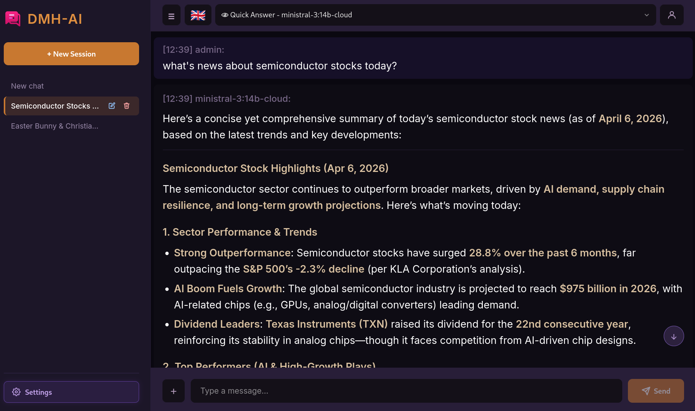
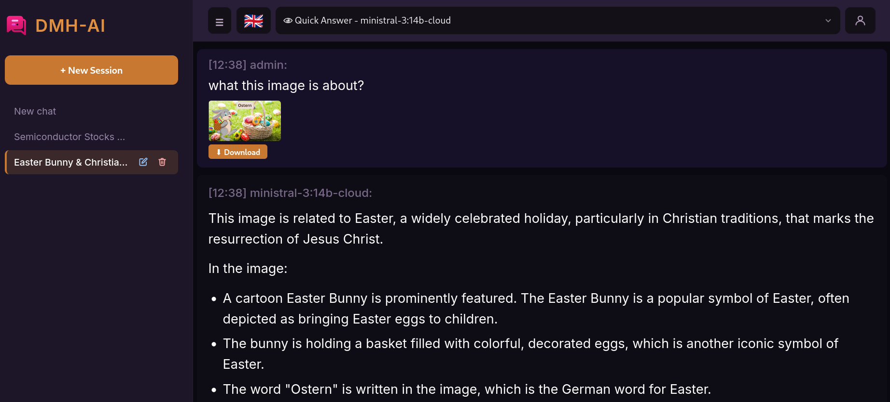

# DMH-AI

Ứng dụng chat AI tự host chạy trên máy tính của bạn — giống ChatGPT, nhưng riêng tư, miễn phí và hoàn toàn thuộc về bạn.

Vì DMH-AI chạy trên máy của bạn, **bạn hoàn toàn kiểm soát dữ liệu của mình**. Mọi cuộc trò chuyện, bộ nhớ đồng hành, ghi chú riêng tư, tệp đính kèm — tất cả đều lưu trên phần cứng của bạn, trong không gian của bạn. Không bên thứ ba nào có thể truy cập, phân tích hay khai thác. Khi dùng các mô hình AI cloud, chỉ có nội dung văn bản của mỗi yêu cầu được gửi đi xử lý — không có gì khác rời khỏi máy của bạn.

DMH-AI là sản phẩm của **DMHDigitrans e.K.**

## Ảnh chụp màn hình


*Hỏi về bất kỳ thông tin nào cần cập nhật, DMH-AI tự động tìm kiếm web, lấy dữ liệu thực và trả lời có nguồn dẫn.*

---


*Thả ảnh hoặc video bất kỳ vào và đặt câu hỏi.*

---

## DMH-AI — người bạn đồng hành AI riêng tư của bạn

Theo phong cách hội thoại, giống ChatGPT. Bạn nhắn, câu trả lời được phát trực tiếp về. Dùng cho các câu hỏi hàng ngày, hỗ trợ viết lách, phân tích hình ảnh và brainstorming — bất cứ khi nào bạn muốn có câu trả lời ngay lập tức và riêng tư.

Điều khiến DMH-AI không chỉ là một công cụ chat:

- **Thả vào tệp bất kỳ.** PDF, tài liệu Word, bảng tính, ảnh, video. Hỏi trực tiếp về chúng. Trên điện thoại, có thể chụp ảnh hoặc quay video thẳng vào chat.
- **Tự động tìm kiếm web.** DMH-AI tự quyết định xem câu hỏi của bạn có cần thông tin trực tiếp hay không. Nếu cần, nó tìm kiếm web, lấy nội dung trang và đưa ra câu trả lời có nguồn dẫn — không cần bật "chế độ tìm kiếm" gì cả.
- **`/memo` cho ghi chú riêng tư.** Gõ `/memo Khóa SSH homelab của tôi là X` hoặc `/memo Tôi thích Tailwind hơn CSS thuần`, và DMH-AI ghi nhớ. Lần sau khi chủ đề liên quan xuất hiện — kể cả nhiều tháng sau — những ghi chú đó được tự động truy xuất lại. **Mã hóa khi lưu**, với khóa nằm ngoài cơ sở dữ liệu — kể cả bản sao lưu DB bị đánh cắp cũng không thể đọc được.
- **Nó lớn lên cùng bạn.** DMH-AI xây dựng hồ sơ về bạn theo thời gian — sở thích, bối cảnh, những gì bạn chia sẻ — và dùng sự hiểu biết đó để đưa ra câu trả lời phù hợp, cá nhân hóa hơn. Nằm trên phần cứng của bạn; có thể xem hoặc xóa bất kỳ lúc nào trong Cài đặt hội thoại.
- **`/tts` đọc câu trả lời thành tiếng.** Biến bất kỳ câu trả lời nào thành giọng nói tự nhiên.
- **Không có giới hạn bộ nhớ.** Phiên dài đến đâu cũng được — ngữ cảnh cũ được nén thông minh. Bạn không bao giờ chạm trần token.

---

## Tính năng nổi bật

- **Bộ nhớ đồng hành & ghi chú riêng tư** — hồ sơ tự xây + ghi chú `/memo` mã hóa, tất cả trên phần cứng của bạn
- **Tìm kiếm web tích hợp** — tương tự Perplexity, nhưng tự host và riêng tư; hoạt động với mọi ngôn ngữ
- **Đính kèm đa phương tiện** — PDF, DOCX, XLSX, hình ảnh và video; trên điện thoại có thể chụp hoặc quay thẳng vào chat
- **Chuyển văn bản thành giọng nói** — `/tts` đọc bất kỳ câu trả lời nào thành tiếng
- **Hỗ trợ nhiều người dùng** — mỗi người có đăng nhập, lịch sử và tệp riêng; admin quản lý người dùng ngay trong ứng dụng
- **Lưu lịch sử chat** — toàn bộ cuộc trò chuyện được lưu và có thể tìm lại
- **Giao diện đa ngôn ngữ** — Tiếng Anh, Tiếng Việt, Tiếng Đức, Tiếng Tây Ban Nha, Tiếng Pháp
- **Truy cập từ mọi thiết bị trong mạng nội bộ** — điện thoại, máy tính bảng, laptop

---

## Cài đặt

### Bước 1 — Cài Docker

Docker chạy DMH-AI trong một container độc lập.

**Linux:**
```bash
curl -fsSL https://get.docker.com | sh
```

**macOS / Windows:** Tải và chạy **Docker Desktop** từ [docker.com/products/docker-desktop](https://www.docker.com/products/docker-desktop/). Sau khi cài, mở Docker Desktop và đợi biểu tượng cá voi trên thanh menu (macOS) hoặc thanh tác vụ (Windows) ngừng chuyển động — khi đó là sẵn sàng.

### Bước 2 — Build và cài đặt DMH-AI

**Linux / macOS:**
```bash
./scripts/build.sh         # build Docker image và tạo dist/
sudo ./dist/install.sh     # cài vào /opt/dmh_ai/ và đăng ký lệnh dmh_ai
dmh_ai start        # khởi động ứng dụng
```

Để cài đặt độc lập ở cấp người dùng — mọi thứ nằm dưới `~/.dmh_ai/`, không cần sudo — dùng `--stage`:

```bash
./scripts/build.sh --stage
./dist/install.sh --stage     # không cần sudo
dmh_ai start
```

Mở [http://localhost:8080](http://localhost:8080) trong trình duyệt.

### Quản lý ứng dụng

```bash
dmh_ai start      # khởi động
dmh_ai stop       # dừng
dmh_ai restart    # khởi động lại (tự nhận bản build mới)
dmh_ai status     # xem trạng thái container
dmh_ai logs       # xem nhật ký container
```

Sau khi cập nhật code, build lại và cài lại:
```bash
./scripts/build.sh --no-export   # build lại image, không xuất tar (nhanh hơn)
sudo ./dist/install.sh           # cập nhật cấu hình đã cài; giữ nguyên toàn bộ dữ liệu
dmh_ai restart
```

### Đăng nhập lần đầu

Lần đầu khởi chạy, DMH-AI tạo tài khoản admin mặc định:

| Tên đăng nhập | Mật khẩu |
|---|---|
| `admin` | `dmh_ai` |

Đăng nhập xong, **đổi mật khẩu ngay**: nhấn biểu tượng người dùng (góc trên phải) → **Đổi mật khẩu**.

---

## Kết nối dịch vụ AI (admin)

DMH-AI cần một backend AI để hoạt động. Admin cấu hình điều này một lần trong Cài đặt. Người dùng không tương tác với việc chọn mô hình.

### Mặc định — Ollama cloud

Ollama cung cấp mô hình AI cloud mạnh mẽ hoàn toàn miễn phí, với hạn mức sử dụng rộng rãi. Đây là cách thiết lập đơn giản nhất: không cần GPU, không yêu cầu phần cứng đặc biệt.

1. Vào [ollama.com](https://ollama.com) và tạo tài khoản miễn phí
2. Nhấn vào ảnh đại diện → **Settings** → **API Keys** → **Create new key**, sao chép key
3. Trong DMH-AI: biểu tượng người dùng → **Cài đặt** → **Ollama Cloud — Tài khoản API** → **Thêm tài khoản**, dán key vào

Vậy là xong. DMH-AI sẵn sàng ngay lập tức cho tất cả người dùng.

Trong thiết lập này, chỉ có nội dung văn bản của mỗi yêu cầu AI được gửi đến máy chủ Ollama để xử lý. Toàn bộ dữ liệu người dùng — lịch sử chat, bộ nhớ đồng hành, tệp đã tải lên, ghi chú `/memo` — đều ở lại trên máy của bạn và không bao giờ được chia sẻ với bất kỳ bên thứ ba nào.

### Thay thế — Ollama local (hoàn toàn offline)

Để có thiết lập mà tuyệt đối không có gì rời khỏi mạng nội bộ — kể cả yêu cầu AI — bạn có thể chuyển sang dùng Ollama chạy cục bộ. Cách này yêu cầu phần cứng đủ mạnh để chạy mô hình AI (CPU hiện đại là đủ cho các mô hình nhỏ; GPU giúp tăng tốc đáng kể cho các mô hình lớn hơn).

**Cài Ollama:**

```bash
# Linux
curl -fsSL https://ollama.com/install.sh | sh
```

macOS / Windows: tải từ [ollama.com/download](https://ollama.com/download). Ollama tự khởi động sau khi cài xong.

**Tải mô hình** (admin quyết định dùng mô hình nào):
```bash
ollama pull <tên-mô-hình>
```

Trên Linux, khởi động Ollama nếu chưa chạy dưới dạng dịch vụ:
```bash
ollama serve
```

Trong cài đặt admin của DMH-AI, trỏ **Ollama Local — URL Endpoint** vào instance Ollama của bạn (ví dụ: `http://localhost:11434`) và cấu hình Mô hình AI để dùng tên mô hình local.

---

## Truy cập từ thiết bị khác trong mạng

Mặc định DMH-AI chỉ bind vào `127.0.0.1` — chỉ truy cập riêng tư được từ máy chạy nó. Để mở trên mọi giao diện mạng cho điện thoại, máy tính bảng và các máy khác trong cùng Wi-Fi truy cập, đặt `DMHAI_BIND_HOST=0.0.0.0` trước khi khởi động:

```
DMHAI_BIND_HOST=0.0.0.0 dmh_ai start
```

Sau đó tìm địa chỉ IP local của máy bạn (ví dụ: `192.168.1.10`) và mở `http://192.168.1.10:8080` trên thiết bị bất kỳ.

**Nhập liệu bằng giọng nói** cần HTTPS. Dùng `https://<địa-chỉ-IP>:8443`. Trình duyệt sẽ hiện cảnh báo về chứng chỉ tự ký — đây là bình thường, chấp nhận một lần. Trên iOS, nhấn vào liên kết trong cảnh báo chứng chỉ để tải về và cài qua Cài đặt (làm một lần cho mỗi thiết bị).

Để quay lại truy cập riêng tư (chỉ `127.0.0.1`), khởi động lại mà không có biến môi trường: `dmh_ai restart`.

---

## Tài liệu tham khảo Cài đặt Admin

Nhấn biểu tượng người dùng → **Cài đặt** (chỉ admin).

**Ollama Cloud — Tài khoản API**

Thêm một hoặc nhiều tài khoản (nhãn + API key). DMH-AI tự động luân phiên qua tất cả tài khoản đã thêm — nếu một tài khoản bị giới hạn lượt dùng, tài khoản tiếp theo tiếp quản mà không bị gián đoạn.

**Ví dụ:** Một gia đình bốn người, mỗi người tạo một tài khoản Ollama miễn phí rồi thêm cả bốn key vào đây. DMH-AI tự động phân phối tải một cách minh bạch — không ai trong gia đình cần quan tâm tài khoản nào đang được dùng hay hạn mức có bị vượt không.

**Mô hình AI**

Cấu hình mô hình AI cho từng vai trò: hội thoại DMH-AI, phân loại nhanh (Swift), tóm tắt ngữ cảnh dài (Oracle), phân tích hình ảnh và video, embedding. Mỗi vai trò có thể dùng một mô hình khác nhau được tối ưu cho nhiệm vụ đó.

**Ollama Local — URL Endpoint**

Mặc định, DMH-AI kết nối Ollama tại `http://localhost:11434`. Thay đổi nếu Ollama chạy trên máy khác trong mạng nội bộ (ví dụ: máy chủ tại nhà).

---

## Tìm kiếm web

DMH-AI tích hợp quy trình tìm kiếm web — tương tự Perplexity hay ChatGPT Search, nhưng tự host và riêng tư.

**Cách hoạt động:**

1. Bạn đặt câu hỏi bằng bất kỳ ngôn ngữ nào
2. AI tự đánh giá xem câu hỏi có cần thông tin trực tiếp từ web không (không dùng từ khóa cứng — nó hiểu ý định)
3. Nếu cần, DMH-AI tìm kiếm qua SearXNG tích hợp và lấy kết quả hàng đầu
4. AI tổng hợp kết quả thành câu trả lời mạch lạc, có cấu trúc, có nguồn dẫn

Bạn không cần làm gì khác — chỉ cần hỏi. Truy vấn tìm kiếm đi qua SearXNG tự host của bạn, không qua dịch vụ bên thứ ba nào.

---

## Dữ liệu của bạn

Sau khi chạy `./dist/install.sh`, toàn bộ dữ liệu được lưu trong `~/.dmh_ai/`:

- `~/.dmh_ai/db/` — lịch sử chat (cơ sở dữ liệu SQLite)
- `~/.dmh_ai/secrets/` — khóa mã hóa chính cho ghi chú `/memo` (sao lưu **riêng** với cơ sở dữ liệu — xem bên dưới)
- `~/.dmh_ai/user_assets/` — tệp đã tải lên, theo phiên
- `~/.dmh_ai/system_logs/system.log` — nhật ký tìm kiếm web và hệ thống

Chạy lại `./dist/install.sh` là an toàn — không bao giờ ghi đè dữ liệu hiện có. Mỗi tệp chỉ được copy từ `dist/` nếu chưa tồn tại trong `~/.dmh_ai/`.

Để sao lưu hoặc chuyển DMH-AI sang máy khác, sao chép thư mục `~/.dmh_ai/` và chạy `./dist/install.sh` trên máy mới.

**Về mã hóa `/memo`.** Ghi chú đã lưu của bạn được mã hóa bằng một khóa riêng cho từng người dùng, khóa đó lại được bọc bởi khóa chính trong `~/.dmh_ai/secrets/`. Hãy sao lưu thư mục `secrets/` **riêng** với cơ sở dữ liệu — đó chính là điểm cốt lõi: chỉ có bản sao lưu DB không thể giải mã ghi chú của bạn. Nếu bạn mất thư mục `secrets/`, các ghi chú hiện có không còn đọc được nữa (DMH-AI vẫn cho bạn lưu ghi chú mới dưới một khóa mới).

Để thêm người dùng: biểu tượng người dùng → **Quản lý người dùng**.
