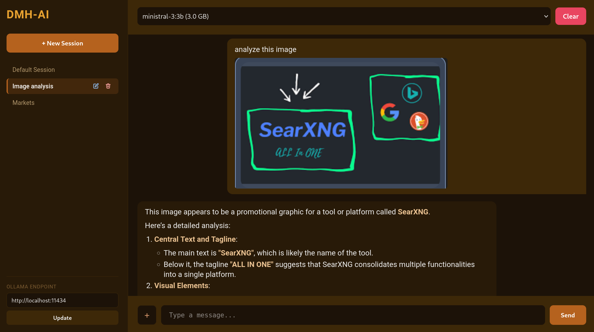
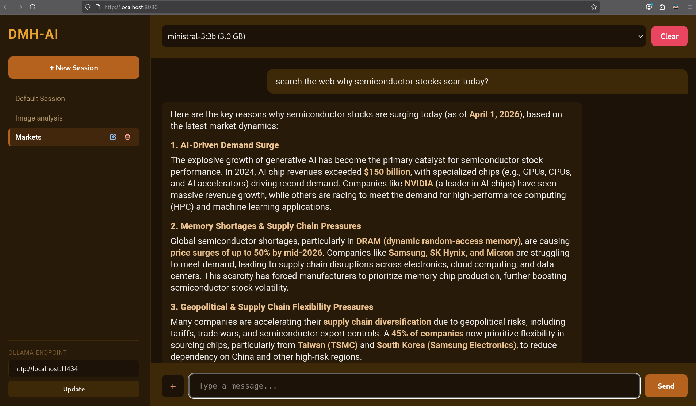

# DMH-AI

A lightweight, self-hosted chat UI for Ollama running on your local machine. Runs entirely in Docker — no Node.js, no Python dependencies.

## Screenshots




## Features

- **Built-in web search** — like Perplexity, but self-hosted and private. DMH-AI automatically detects when your question needs current information, searches the web via a bundled SearXNG instance, and synthesizes the results into a coherent, sourced answer. Works in any language.
- **Rich media attachments** — attach documents (PDF, DOCX, XLSX), images, and videos from your device. On mobile, take a fresh photo or record a video directly and attach it to the chat — no need to save to gallery first.
- Chat with any Ollama model — cloud or local — via a clean browser UI
- Persistent chat sessions stored in SQLite
- Rolling context summarization — chat forever without hitting context limits
- Markdown rendering for assistant responses
- Multi-language UI: English, Vietnamese, German, Spanish, French
- Accessible from any device on your network

## Requirements

- [Docker](https://docs.docker.com/get-docker/) with Compose plugin
- [Ollama](https://ollama.com/download) running locally on port 11434

### Install Ollama

**Linux:**
```bash
curl -fsSL https://ollama.com/install.sh | sh
```

**Windows:**
Download and run the installer from [ollama.com/download](https://ollama.com/download)

Verify it works:
```bash
ollama --version
```

## Step 1 — Choose Your Models

DMH-AI works with both **cloud models** (recommended for most users) and **local models** (for privacy-first use cases). You can mix and match — switch between them freely in the UI.

---

### Option A: Cloud Models (recommended)

**Best for most users.** Ollama's cloud models are fast, powerful, and free to use with generous limits on the free tier. Inference runs on Ollama's servers and streams through your local Ollama instance — no GPU required, no configuration changes in DMH-AI.

**Our top recommendation:**

| Model | Why |
|---|---|
| `mistral-large-3:675b-cloud` | Best all-rounder — fast, vision-capable (analyzes images), excellent at general-purpose chat, coding, reasoning, and multilingual support |
| `ministral-3:14b-cloud` | Medium size, good all-rounder - extremely fast and also vision-capable |

Other cloud models worth trying:

| Model | Notes |
|---|---|
| `qwen3.5:cloud` | Strong multilingual and reasoning |
| `gemini-3-flash-preview:cloud` | Google's flag-ship model, deep reasoning and very fast |

**How to set up:**

1. **Create a free Ollama account** at [ollama.com](https://ollama.com) — click **Sign Up**.

2. **Connect your local Ollama to your account:**
   ```bash
   ollama login
   ```
   This opens a browser window to authenticate. Once logged in, your local Ollama instance is linked to your account.

3. **Pull a cloud model:**
   ```bash
   ollama pull mistral-large-3:675b-cloud
   ```

That's it. The model appears in DMH-AI's dropdown immediately — select it and start chatting.

Cloud models are identified by the `:cloud` tag. They require an internet connection but place zero load on your local hardware.

---

### Option B: Local Models (fully offline, maximum privacy)

**Best if privacy is your top concern.** All data stays on your machine — nothing leaves your network. Requires enough RAM/VRAM to run the model.

**Text and documents (fast, low memory):**

| Model | Size | Notes |
|---|---|---|
| `gemma3n:e2b` | ~5.6 GB | Best small multi-lang general-purpose model |
| `phi4-mini:3.8b` | ~2.5 GB | Good small general-purpose model |
| `granite4:3b` | ~2.1 GB | Strong reasoning and fast |

**Images and vision:**

| Model | Size | Notes |
|---|---|---|
| `ministral-3:3b` | ~3 GB | Supports image input, also good at general-purpose and fast |

**Pull a local model:**
```bash
ollama pull mistral-3:3b
```

On Linux, start Ollama if it's not already running as a service:
```bash
ollama serve
```
On Windows, Ollama starts automatically — no need to run `ollama serve`.

## Step 2 — Install Docker

**Linux:**
```bash
curl -fsSL https://get.docker.com | sh
```

**Windows:** Download and run **Docker Desktop** from [docker.com/products/docker-desktop](https://www.docker.com/products/docker-desktop/). After installing, open Docker Desktop and wait for it to finish starting (the whale icon in the taskbar will stop animating).

## Step 3 — Run DMH-AI

**Linux:**
```bash
./build.sh && ./dist/run.sh
```

**Windows** — in Command Prompt:
```
build.bat && dist\run.bat
```

Open [http://localhost:8080](http://localhost:8080) in your browser. Other devices on your network can access it at `http://<your-machine-ip>:8080`.

For **voice input**, use the HTTPS endpoint at `https://localhost:8443` (or `https://<your-machine-ip>:8443`). Accept the self-signed certificate warning once. On iOS, tap the certificate warning link to download and install the certificate via Settings.

User data persists in:
- `dist/db/` — SQLite chat database
- `dist/user_assets/` — uploaded files, organized by session
- `dist/system_logs/system.log` — web search and system trace log

To migrate to another machine, copy the entire `dist/` folder — all data comes with it.

## Web Search — Your Own Self-Hosted Perplexity

DMH-AI includes a built-in web search pipeline similar to what Perplexity, ChatGPT Search, and Google Gemini offer — but fully self-hosted and private.

**How it works:**

1. You ask a question in any language
2. The LLM judges whether your question needs live web data (no hardcoded keywords — it understands intent)
3. If yes, DMH-AI extracts search keywords, queries the bundled SearXNG search engine, and retrieves the top results
4. The LLM synthesizes the search results into a coherent, well-structured answer grounded in current information

All of this happens automatically and transparently — you just ask your question and get an up-to-date answer. No API keys, no subscriptions, no data leaving your network (search queries go through your self-hosted SearXNG instance).

## Architecture

```
Browser
  ├── nginx :8080 (HTTP)
  └── nginx :8443 (HTTPS, for voice input)
        ├── /          → index.html (SPA)
        ├── /api       → Ollama :11434
        ├── /sessions  → Python backend :3000
        ├── /assets    → Python backend :3000
        ├── /search    → Python backend :3000 → SearXNG :8888
        └── /log       → Python backend :3000
```

The entire frontend is a single `code/index.html` file — vanilla JS, no framework, no build step. The backend is `code/backend/server.py` using only Python stdlib.

## Project Structure

```
code/
  index.html              # entire frontend (HTML + CSS + JS)
  backend/server.py       # sessions API, file uploads, search proxy, logging
  nginx.conf              # reverse proxy config
  Dockerfile              # nginx:alpine + python3
  start.sh                # entrypoint: starts python backend then nginx
  docker-compose.yml      # source compose file
  searxng-settings.yml    # SearXNG config (enables JSON API on port 8888)
  run.sh                  # Linux deployment run script (copied to dist/ by build.sh)
  run.bat                 # Windows deployment run script (copied to dist/ by build.bat)
build.sh                  # Linux: builds images and assembles dist/
build.bat                 # Windows: builds images and assembles dist/
dist/                     # generated by build.sh / build.bat — do not edit manually
```
